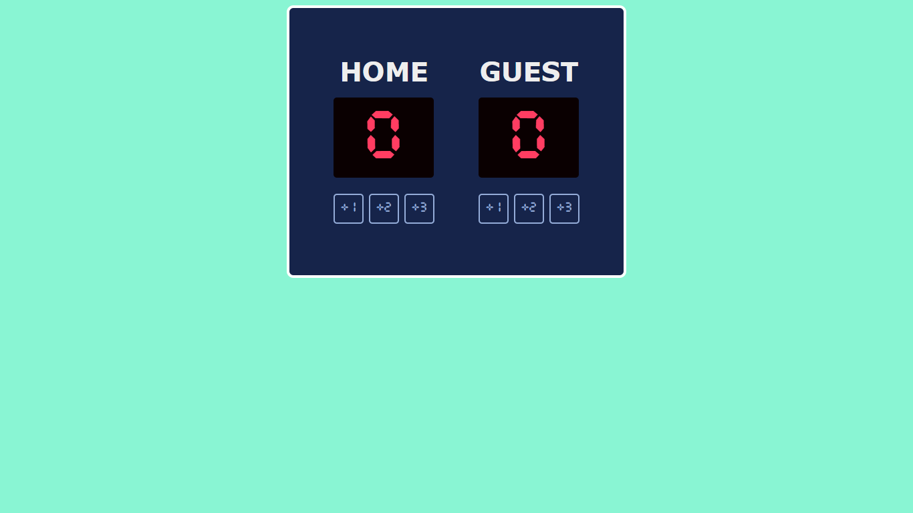

# Basketball Scorecard

A simple and interactive basketball scoring application built as part of the Scrimba solo project challenge.

## 🏀 Project Overview

This project is a functional basketball scorecard that allows users to track scores for two teams during a basketball game. It's designed to be user-friendly and responsive across different devices.

## 🔗 Live Demo


[View the live scorecard](https://anik-hindu.github.io/basketball-scoreboard)

## ✨ Features

- **Real-time Score Tracking**: Update scores instantly for both teams
- **Point Increment Options**: Add 1, 2, or 3 points with a single click
- **Reset Function**: Reset the game to start over
- **Responsive Design**: Works seamlessly on desktop and mobile devices
- **Clean UI**: Intuitive and easy-to-use interface

## 🛠️ Technologies Used

- **HTML5**: Structure and markup
- **CSS3**: Styling and layout
- **JavaScript**: Interactivity and score logic

## 📁 Project Structure

```
basketball-scorecard/
├── assets
├── index.html
├── style.css
├── script.js
└── README.md
```

## 🚀 How to Use

1. **Clone or download** the project files
2. **Open `index.html`** in your web browser
3. **Click the point buttons** to increase each team's score:
   - Click "+1" to add 1 point
   - Click "+2" to add 2 points
   - Click "+3" to add 3 points
4. **Click "Reset"** to clear the scores and start a new game

## 📋 Game Rules

- Each team can accumulate points by clicking the respective point buttons
- The game has no automatic end condition—track the game manually or set a timer
- Use the Reset button to start a fresh game

## 💡 Features Explained

### Score Increment Buttons

Each team has three buttons to add points (1, 2, or 3 points) reflecting standard basketball scoring rules.

### Reset Button

Clears both team scores back to 0, allowing you to start a new game.

### Live Score Display

Both team scores are displayed prominently and update immediately when points are added.

## 🎓 Learning Outcomes

This project demonstrates:

- DOM manipulation with JavaScript
- Event listeners and click handlers
- State management (tracking scores)
- Responsive design principles
- Clean code structure

## 🔧 Possible Enhancements

Future improvements could include:

- Game timer functionality
- Score history/log
- Keyboard shortcuts for faster scoring
- Sound effects for scoring
- Difficulty levels or preset teams
- Local storage to save games
- Dark mode theme

## 📝 Notes

- This is a beginner-friendly project perfect for learning JavaScript interactivity
- No external libraries or frameworks are required
- The scorecard can be easily customized with different colors and fonts

## 🙋 Support

If you have questions or suggestions for improvement, feel free to reach out or create an issue.

## 📄 License

This project is created as part of the Scrimba curriculum. Feel free to use it as a learning resource.

---

**Created**: 04-04-2026  
**Author**: Anik Saha
**Project Type**: Scrimba Solo Project
